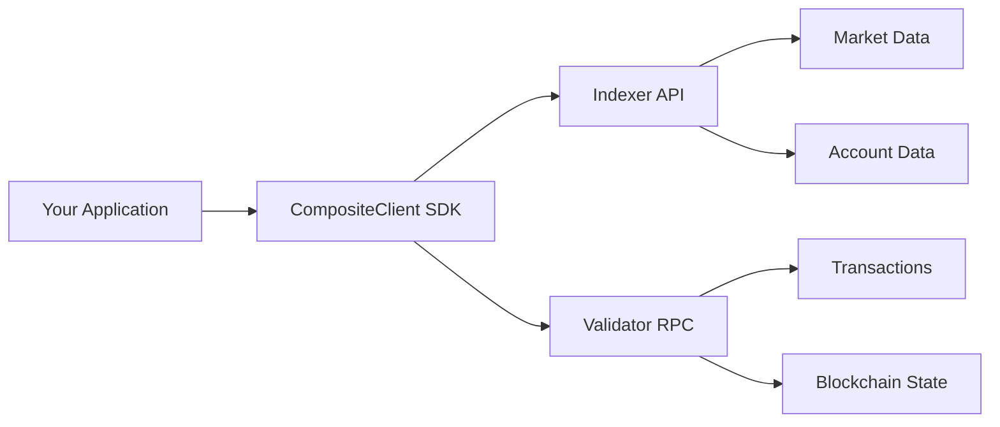

# Building on LFG Perp

LFG Perp provides developers with powerful tools to build decentralized trading applications, automated strategies, and custom interfaces for perpetual futures trading.

## What You Can Build

<CardGroup cols={2}>
  <Card title="Trading Bots" icon="robot">
    Automated strategies that execute trades based on your algorithms and market
    conditions
  </Card>
  <Card title="Portfolio Managers" icon="folder-open">
    Applications for managing multiple positions, subaccounts, and risk across
    markets
  </Card>
  <Card title="Market Makers" icon="arrows-left-right">
    High-frequency bots that provide liquidity and capture spreads
  </Card>
  <Card title="Analytics Dashboards" icon="chart-mixed">
    Custom UIs for tracking positions, PnL, funding rates, and market data
  </Card>
  <Card title="Arbitrage Bots" icon="scale-balanced">
    Tools to capitalize on price differences across markets and exchanges
  </Card>
  <Card title="Risk Management Tools" icon="shield">
    Applications for monitoring margin health, liquidation risks, and exposure
  </Card>
</CardGroup>

## Development Stack

### TypeScript/JavaScript SDK

The official `@oraichain/lfg-client-js` SDK provides:

<Tabs>
  <Tab title="Core Features">
    - **CompositeClient**: Unified interface combining Indexer (read) +
    Validator (write) - **LocalWallet**: Wallet management with mnemonic and
    private key support - **SubaccountInfo**: Manage multiple trading
    subaccounts - **Type Safety**: Full TypeScript support with comprehensive
    type definitions
  </Tab>

  <Tab title="Market Data">
    - Real-time orderbook updates via WebSocket - Historical price and volume
    data - Funding rates and open interest - Market statistics and rankings
  </Tab>

  <Tab title="Trading">
    - Place short-term and long-term orders - Cancel and modify orders - Query
    open orders and fills - Support for all order types (limit, market, stop)
  </Tab>

  <Tab title="Account Management">
    - Query balances and collateral - Manage multiple subaccounts - Transfer
    between subaccounts - Deposit and withdraw funds
  </Tab>
</Tabs>

### Architecture Components

LFG Perp's architecture consists of three main components:



<AccordionGroup>
  <Accordion title="Indexer" icon="database">
    **Purpose**: Fast read-only access to market and account data
    
    **Provides**:
    - Orderbooks
    - Market prices and statistics
    - Account balances and positions
    - Trade history
    - Funding rate history
    
    **Technology**: REST API + WebSocket subscriptions
  </Accordion>

  <Accordion title="Validator" icon="server">
    **Purpose**: Blockchain interaction for transactions
    
    **Provides**:
    - Order placement
    - Order cancellation
    - Deposits and withdrawals
    - Account queries
    - Block information
    
    **Technology**: Cosmos SDK RPC endpoint
  </Accordion>

  <Accordion title="CompositeClient" icon="layer-group">
    **Purpose**: Unified SDK that combines both Indexer and Validator
    
    **Benefits**:
    - Single interface for all operations
    - Automatic routing to appropriate endpoint
    - Connection management
    - Error handling
    
    **Language**: TypeScript/JavaScript
  </Accordion>
</AccordionGroup>

## Development Workflow

### 1. Setup & Installation

```bash
npm install @oraichain/lfg-client-js
```

[Learn more →](/development/sdk-setup)

### 2. Configuration

Choose your network and configure endpoints:

```typescript
import { Network, CompositeClient } from "@oraichain/lfg-client-js";

// Staging for development
const network = Network.staging();

// Mainnet for production
// const network = Network.mainnet();

const client = await CompositeClient.connect(network);
```

[Learn more →](/development/configuration)

### 3. Wallet Setup

Create or import a wallet:

```typescript
import { LocalWallet } from "@oraichain/lfg-client-js";

const wallet = await LocalWallet.fromMnemonic(process.env.MNEMONIC, "lfg");
```

[Learn more →](/guides/wallets-subaccounts)

### 4. Build & Deploy

Implement your trading logic and deploy:

```typescript
// Query markets
const markets = await client.indexerClient.markets.getPerpetualMarkets();

// Place orders
const tx = await client.placeShortTermOrder(/* ... */);

// Monitor positions
const account =
  await client.indexerClient.account.getParentSubaccount(/* ... */);
```

[See examples →](/development/quickstart)

## Development Environments

<Tabs>
  <Tab title="Staging (Testnet)">
    **Use for**: Development, testing, and experimentation **Characteristics**:
    - Test tokens with no real value - Same features as mainnet - Freely
    available test USDC - Safe to experiment ```typescript const network =
    Network.staging(); ```
    <Tip>Always develop and test on staging before deploying to mainnet.</Tip>
  </Tab>

  <Tab title="Mainnet (Production)">
    **Use for**: Production applications with real funds **Characteristics**: -
    Real USDC and assets - Production-ready - Higher stakes - Same API as
    staging ```typescript const network = Network.mainnet(); ```
    <Warning>
      Test thoroughly on staging before using mainnet with real funds.
    </Warning>
  </Tab>
</Tabs>

## Common Use Cases

### Trading Bot Example

```typescript
class SimpleTradingBot {
  private client: CompositeClient;
  private wallet: LocalWallet;

  async initialize() {
    const network = Network.staging();
    this.client = await CompositeClient.connect(network);
    this.wallet = await LocalWallet.fromMnemonic(process.env.MNEMONIC, "lfg");
  }

  async executeTrade(
    market: string,
    side: OrderSide,
    price: number,
    size: number
  ) {
    const subaccount = SubaccountInfo.forLocalWallet(this.wallet, 0);
    const currentBlock =
      await this.client.validatorClient.get.latestBlockHeight();

    return await this.client.placeShortTermOrder(
      subaccount,
      market,
      side,
      price,
      size,
      Math.floor(Math.random() * 100000000),
      currentBlock + 20,
      Order_TimeInForce.TIME_IN_FORCE_UNSPECIFIED,
      false
    );
  }

  async monitorMarket(market: string) {
    const markets =
      await this.client.indexerClient.markets.getPerpetualMarkets();
    const marketData = markets.markets[market];

    return {
      price: parseFloat(marketData.oraclePrice),
      volume: parseFloat(marketData.volume24H),
      change: parseFloat(marketData.priceChange24H),
    };
  }
}
```

[See complete examples →](/development/quickstart)

## Best Practices

<AccordionGroup>
  <Accordion title="Security" icon="shield">
    - Never hardcode private keys or mnemonics
    - Use environment variables for sensitive data
    - Implement proper key management
    - Use separate keys for different purposes
    
    [Learn more →](/resources/security)
  </Accordion>

  <Accordion title="Error Handling" icon="triangle-exclamation">
    - Implement retry logic for network failures
    - Handle rate limits gracefully
    - Validate responses before processing
    - Log errors for debugging
    
    [Learn more →](/resources/errors)
  </Accordion>

  <Accordion title="Performance" icon="gauge-high">
    - Cache account numbers for faster transactions
    - Use WebSocket for real-time data
    - Batch operations when possible
    - Monitor API rate limits
  </Accordion>

  <Accordion title="Testing" icon="flask">
    - Always test on staging first
    - Use small amounts for initial tests
    - Monitor margin health in tests
    - Implement automated testing
  </Accordion>
</AccordionGroup>

## Resources

<CardGroup cols={2}>
  <Card title="Quickstart" icon="rocket" href="/development/quickstart">
    Build your first trading bot
  </Card>
  <Card title="SDK Setup" icon="download" href="/development/sdk-setup">
    Install and configure the SDK
  </Card>
  <Card title="Trading Guides" icon="book" href="/guides/orders">
    Learn trading operations
  </Card>
  <Card
    title="API Reference"
    icon="code"
    href="/sdk-reference/composite-client"
  >
    Complete SDK documentation
  </Card>
</CardGroup>

## Community & Support

<CardGroup cols={3}>
  <Card title="Discord" icon="discord" href="https://discord.gg/oraichain">
    Get help from developers
  </Card>
  <Card
    title="GitHub"
    icon="github"
    href="https://github.com/oraichain/lfg-client-js"
  >
    View source code
  </Card>
  <Card title="FAQ" icon="circle-question" href="/resources/faq">
    Common questions
  </Card>
</CardGroup>

<Note>
  Ready to start building? Head to the [Quickstart
  Guide](/development/quickstart) to build your first application!
</Note>
