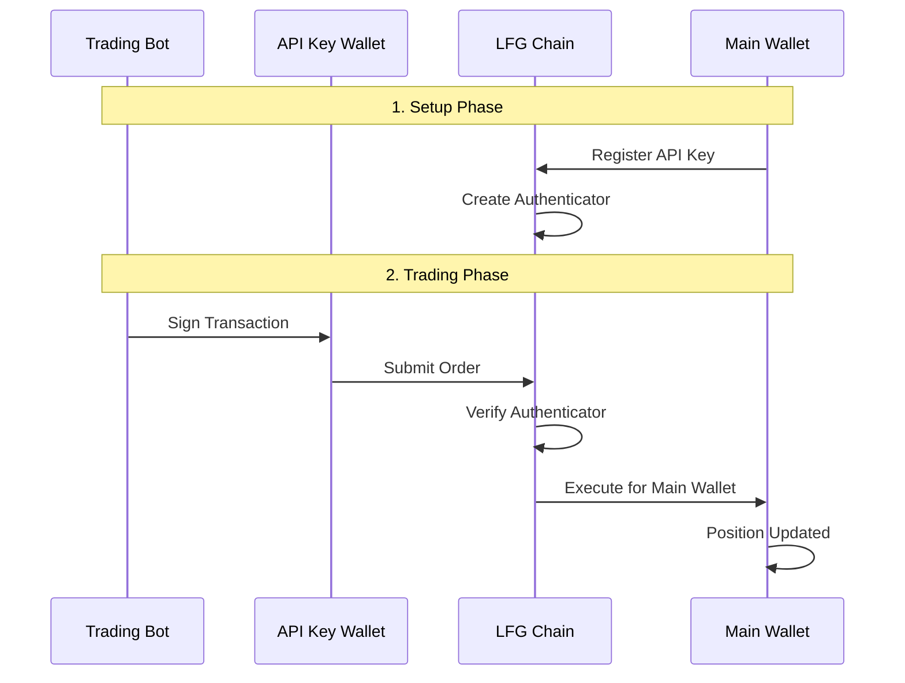

## Overview

API key trading allows you to execute trades on behalf of your main wallet using a separate API key wallet. This keeps your main wallet's private key secure while enabling programmatic trading with bots and automated systems.

<CardGroup cols={2}>
  <Card title="Security" icon="shield">
    Your main wallet's private key stays offline and secure. Only the API key is exposed to your trading bot.
  </Card>
  <Card title="Multiple Keys" icon="layer-group">
    Create multiple API keys for different bots or trading strategies while keeping your main wallet secure.
  </Card>
  <Card title="Easy Rotation" icon="rotate">
    If an API key is compromised, simply revoke it and create a new one without affecting your main wallet.
  </Card>
  <Card title="Team Collaboration" icon="users">
    Share API keys with team members or services without sharing your main wallet credentials.
  </Card>
</CardGroup>

## How API Keys Work



**Key Concepts:**

- **Main Wallet**: Holds your funds and positions (private key stays secure)
- **API Key Wallet**: Signs transactions on behalf of main wallet
- **Authenticator**: On-chain permission that links API key to main wallet
- **Subaccount**: The trading account where positions are held

## Setting Up API Key Trading

<Steps>
  <Step title="Create API Key in Web Interface">
    Go to the LFG web interface to create your API key:
    
    1. Visit [https://lfg.land](https://lfg.land)
    2. Connect your main wallet
    3. Navigate to **Settings** → **API Keys**
    4. Click **Create New API Key**
    5. **Download and save the private key** - it will only be shown once
    6. Note the authenticator ID displayed
    
    <Warning>
      **Save the private key immediately!** You won't be able to view it again. Store it securely - this key will be used by your trading bot.
    </Warning>
    
    <Note>
      API keys have **trading permissions only** - they can place and cancel orders but cannot withdraw funds from your account.
    </Note>
  </Step>

  <Step title="Configure Your Bot">
    Use the private key from the website in your trading bot:
    
    ```typescript
    import { LocalWallet } from "@oraichain/lfg-client-js";
    
    // Use the private key from the website
    const apiKeyWallet = await LocalWallet.fromPrivateKey(
      process.env.API_KEY_PRIVATE_KEY!, // Private key from website
      "lfg"
    );
    
    console.log("API Key Address:", apiKeyWallet.address);
    ```
    
    <Tip>
      Store the private key in environment variables, never hardcode it in your source code.
    </Tip>
  </Step>

  <Step title="Get Authenticator ID">
    The authenticator ID is shown in the web interface when you create the API key. You can also retrieve it programmatically:
    
    ```typescript
    const client = await CompositeClient.connect(Network.staging());
    const auths = await client.getAuthenticators(MAIN_WALLET_ADDRESS);
    
    // Find your API key's authenticator
    const authenticatorId = auths.accountAuthenticators[0].id;
    console.log("Authenticator ID:", authenticatorId.toString());
    ```
  </Step>
</Steps>

## Configure Your Trading Bot

Set up your bot with the API key configuration:

```typescript
import {
  CompositeClient,
  Network,
  LocalWallet,
  SubaccountInfo,
  OrderSide,
  Order_TimeInForce,
  SelectedGasDenom,
} from "@oraichain/lfg-client-js";

// Configuration
const API_KEY_PRIVATE_KEY = process.env.API_KEY_PRIVATE_KEY!;
const MAIN_WALLET_ADDRESS = process.env.MAIN_WALLET_ADDRESS!;
const AUTHENTICATOR_ID = process.env.AUTHENTICATOR_ID!;

// Create API key wallet
const apiKeyWallet = await LocalWallet.fromPrivateKey(
  API_KEY_PRIVATE_KEY,
  "lfg"
);

// Connect to network
const network = Network.staging();
const client = await CompositeClient.connect(network);
client.setSelectedGasDenom(SelectedGasDenom.USDC);
```

## Placing Orders with API Keys

### Complete Example

Here's a complete example of placing an order using an API key:

```typescript
async function placeOrderWithApiKey() {
  try {
    // 1. Create API key wallet (main wallet stays offline)
    const apiKeyWallet = await LocalWallet.fromPrivateKey(
      API_KEY_PRIVATE_KEY,
      "lfg"
    );

    // 2. Connect to network
    const network = Network.staging();
    const client = await CompositeClient.connect(network);
    client.setSelectedGasDenom(SelectedGasDenom.USDC);

    // 3. Get authenticator ID for this API key
    const auths = await client.getAuthenticators(MAIN_WALLET_ADDRESS);
    const authenticatorId = auths.accountAuthenticators[0].id;

    console.log(`Using authenticator ID: ${authenticatorId.toString()}`);

    // 4. Create permissioned subaccount
    const subaccount = SubaccountInfo.forPermissionedWallet(
      apiKeyWallet,           // API key signs the transaction
      MAIN_WALLET_ADDRESS,    // Trading for main wallet's account
      0,                      // Subaccount number
      [authenticatorId]       // Authenticator ID from registration
    );

    // 5. Place order
    const currentBlock = await client.validatorClient.get.latestBlockHeight();
    const goodTilBlock = currentBlock + 20;
    const clientId = Math.floor(Math.random() * 100000000);

    const tx = await client.placeShortTermOrder(
      subaccount,
      "ETH-USD",                                  // Market
      OrderSide.BUY,                              // Buy order
      3800,                                       // Price: $3800/ETH
      0.1,                                        // Size: 0.1 ETH
      clientId,
      goodTilBlock,
      Order_TimeInForce.TIME_IN_FORCE_UNSPECIFIED,
      false
    );

    console.log("✅ Order placed successfully!");
    console.log("Transaction hash:", Buffer.from(tx.hash).toString("hex"));
    console.log("Client ID:", clientId);

    return tx;
  } catch (error) {
    console.error("❌ Order failed:", error);
    throw error;
  }
}

// Execute
placeOrderWithApiKey();
```

### Key Differences from Regular Trading

The main difference when using API keys is creating the subaccount:

<Tabs>
  <Tab title="With API Key">
    ```typescript
    // API key signs, main wallet owns
    const subaccount = SubaccountInfo.forPermissionedWallet(
      apiKeyWallet,           // Signer
      MAIN_WALLET_ADDRESS,    // Owner
      0,                      // Subaccount number
      [authenticatorId]       // Permission proof
    );
    ```
  </Tab>

  <Tab title="Without API Key">
    ```typescript
    // Main wallet signs and owns
    const subaccount = SubaccountInfo.forLocalWallet(
      mainWallet,             // Signer & Owner
      0                       // Subaccount number
    );
    ```
  </Tab>
</Tabs>

## Security Best Practices

<AccordionGroup>
  <Accordion title="Secure Storage" icon="vault">
    **Never hardcode API keys:**
    
    ```typescript
    // ❌ Bad - Hardcoded
    const API_KEY = "0x1234...";
    
    // ✅ Good - Environment variable
    const API_KEY = process.env.API_KEY_PRIVATE_KEY;
    
    // ✅ Better - Secret management service
    const API_KEY = await secretManager.getSecret("api-key");
    ```
    
    **Use `.env` files** (add to `.gitignore`):
    
    ```bash
    API_KEY_PRIVATE_KEY=0x...
    MAIN_WALLET_ADDRESS=lfg1...
    AUTHENTICATOR_ID=1
    ```
  </Accordion>

  <Accordion title="Key Rotation" icon="rotate">
    Regularly rotate your API keys:
    
    1. Generate new API key
    2. Register new key in web interface
    3. Update bot configuration
    4. Test with small orders
    5. Revoke old key
    
    **Rotation Schedule:**
    - High-value accounts: Monthly
    - Production bots: Quarterly
    - Development: After major changes
  </Accordion>

  <Accordion title="Limit Exposure" icon="shield-halved">
    API keys have trading-only permissions by design:
    
    - **Can do**: Place and cancel orders
    - **Cannot do**: Withdraw funds from your account
    - **Best practice**: Create separate API keys for different bots or strategies
    
    This built-in limitation minimizes damage if a key is compromised.
  </Accordion>

  <Accordion title="Monitor Activity" icon="eye">
    Regularly audit API key usage:
    
    ```typescript
    async function auditAPIKeyActivity(
      client: CompositeClient,
      walletAddress: string
    ) {
      // Get recent orders
      const orders = await client.indexerClient.account.getSubaccountOrders(
        walletAddress,
        0
      );
      
      // Check for unusual activity
      const recentOrders = orders.filter(
        order => Date.parse(order.createdAt) > Date.now() - 86400000
      );
      
      if (recentOrders.length > 1000) {
        console.warn("⚠️ Unusual order volume detected!");
      }
      
      return recentOrders;
    }
    ```
  </Accordion>
</AccordionGroup>

## Environment Configuration

### Production Setup

```bash .env.production
# Main wallet (public address only - private key stays secure)
MAIN_WALLET_ADDRESS=lfg1...

# API Key for trading
API_KEY_PRIVATE_KEY=0x...
AUTHENTICATOR_ID=1

# Network
NETWORK=mainnet
```

### Development Setup

```bash .env.development
# Test wallet address
MAIN_WALLET_ADDRESS=lfg1...

# Test API key
API_KEY_PRIVATE_KEY=0x...
AUTHENTICATOR_ID=1

# Network
NETWORK=staging
```

<Note>
  API keys only have trading permissions. For withdrawals or other sensitive operations, you must use your main wallet directly.
</Note>

## Troubleshooting

<AccordionGroup>
  <Accordion title="Authenticator not found" icon="triangle-exclamation">
    **Problem:** Error finding authenticator for API key
    
    **Solutions:**
    1. Verify API key is registered in web interface
    2. Check authenticator ID is correct
    3. Ensure API key wallet matches registered public key
    4. Wait a few blocks after registration
    
    ```typescript
    // Debug: List all authenticators
    const auths = await client.getAuthenticators(MAIN_WALLET_ADDRESS);
    console.log("Available authenticators:",
      auths.accountAuthenticators.map(a => a.id.toString())
    );
    ```
  </Accordion>

  <Accordion title="Permission denied" icon="ban">
    **Problem:** Transaction rejected due to insufficient permissions
    
    **Solutions:**
    1. Verify the API key is properly registered
    2. Ensure authenticator is active (not revoked)
    3. Check that you're using the correct authenticator ID
    4. Re-register API key if needed
    
    <Note>
      API keys only have trading permissions. If you need to withdraw funds, use your main wallet directly.
    </Note>
  </Accordion>

  <Accordion title="Wrong subaccount" icon="folder-xmark">
    **Problem:** Order placed in wrong subaccount
    
    **Solution:** Verify subaccount number in `SubaccountInfo`:
    
    ```typescript
    // Correct subaccount
    const subaccount = SubaccountInfo.forPermissionedWallet(
      apiKeyWallet,
      MAIN_WALLET_ADDRESS,
      0,  // ← Check this matches your target subaccount
      [authenticatorId]
    );
    ```
  </Accordion>
</AccordionGroup>

## Advanced: Finding the Correct Authenticator

If you have multiple API keys, you need to find the right authenticator:

```typescript
function hasMatchingPubKey(config: any, targetPubKey: string): boolean {
  // Recursive search through authenticator config
  if (Array.isArray(config)) {
    return config.some((item) => hasMatchingPubKey(item, targetPubKey));
  }

  if (typeof config === "object" && config !== null) {
    if (
      config.type === "SIGNATURE_VERIFICATION" &&
      config.config === targetPubKey
    ) {
      return true;
    }
    return Object.values(config).some((value) =>
      hasMatchingPubKey(value, targetPubKey)
    );
  }

  return false;
}

async function findAuthenticatorForAPIKey(
  client: CompositeClient,
  mainWalletAddress: string,
  apiKeyWallet: LocalWallet
): Promise<Long | null> {
  const auths = await client.getAuthenticators(mainWalletAddress);
  const targetPubKey = apiKeyWallet.pubKey!.value;

  for (const auth of auths.accountAuthenticators) {
    try {
      const configBytes = Buffer.from(auth.config as any, "base64");
      const configString = configBytes.toString("utf-8");
      const config = JSON.parse(configString);

      if (hasMatchingPubKey(config, targetPubKey)) {
        return auth.id;
      }
    } catch (error) {
      continue;
    }
  }

  return null;
}

// Usage
const authenticatorId = await findAuthenticatorForAPIKey(
  client,
  MAIN_WALLET_ADDRESS,
  apiKeyWallet
);

if (!authenticatorId) {
  throw new Error("No matching authenticator found for this API key");
}
```

## Next Steps

<CardGroup cols={2}>
  <Card title="Order Management" icon="list-check" href="/guides/orders">
    Learn more about placing and managing orders
  </Card>
  <Card title="Security Guide" icon="shield" href="/resources/security">
    Comprehensive security best practices
  </Card>
  <Card title="Wallet Management" icon="wallet" href="/guides/wallets-subaccounts">
    Understand subaccounts and permissions
  </Card>
  <Card title="Error Handling" icon="triangle-exclamation" href="/resources/errors">
    Handle common errors and edge cases
  </Card>
</CardGroup>

<Tip>
Always test API key trading on staging network before using on mainnet with real funds!
</Tip>
