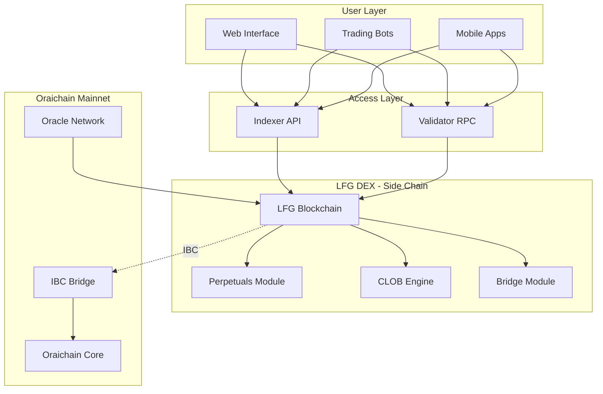
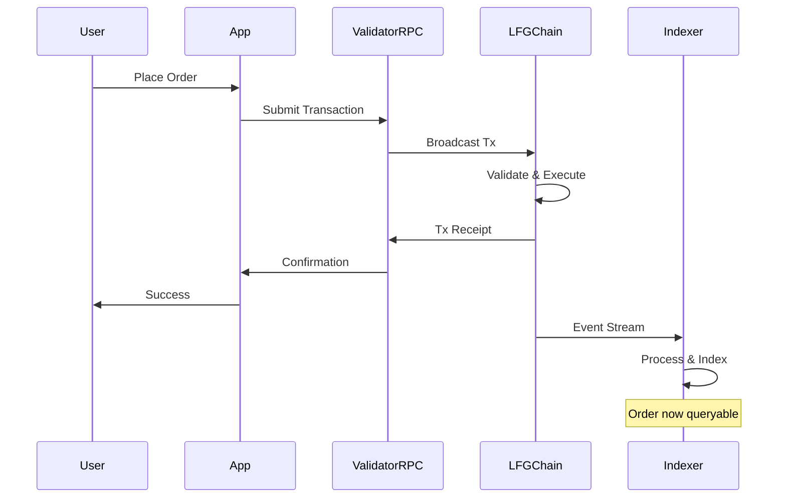
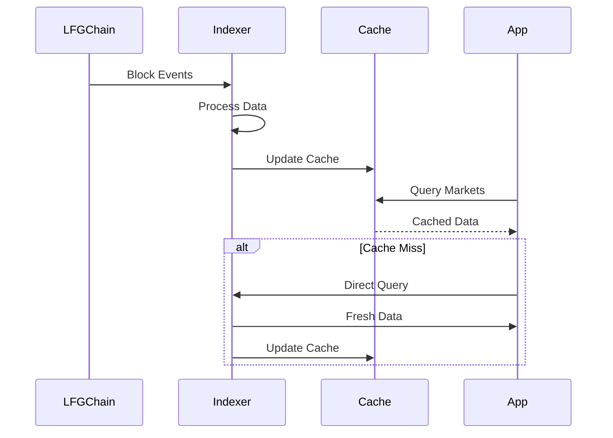

# LFG Perp Architecture

LFG Perp is built on a modern, scalable architecture that combines the security of blockchain with the performance needed for high-frequency trading.

## System Overview



<Note>
  The **@oraichain/lfg-client-js SDK** is a TypeScript client library that
  developers use to interact with the Indexer API and Validator RPC. It's not
  part of the core architecture, but rather a convenient tool for building
  applications.
</Note>

## Core Components

### 1. LFG DEX Side Chain

LFG DEX runs as an independent side chain connected to Oraichain mainnet via IBC (Inter-Blockchain Communication):

<CardGroup cols={2}>
  <Card title="Independent Chain" icon="link">
    **Dedicated Infrastructure**
    - Own validator set
    - Optimized for trading
    - High throughput for orders
    - Custom trading modules
  </Card>

  <Card title="IBC Connected" icon="bridge">
    **Oraichain Integration**
    - Asset transfers via IBC
    - Oracle price feeds from mainnet
    - Shared security guarantees
    - Cross-chain interoperability
  </Card>

  <Card title="Specialized Design" icon="gears">
    **Trading Optimized**
    - Fast block times (~1s)
    - Efficient order matching
    - Low latency execution
    - High transaction throughput
  </Card>

  <Card title="Cosmos SDK" icon="cube">
    **Built on Cosmos**
    - Tendermint consensus
    - Modular architecture
    - Proven technology
    - Easy upgrades
  </Card>
</CardGroup>

### 2. Oraichain Mainnet

The main Oraichain blockchain that LFG DEX connects to:

<CardGroup cols={2}>
  <Card title="IBC Hub" icon="network-wired">
    **Cross-Chain Bridge**
    - IBC protocol support
    - Asset transfers to LFG DEX
    - Multi-chain connectivity
    - Secure bridging
  </Card>

  <Card title="Oracle Services" icon="satellite-dish">
    **Price Feeds**
    - Decentralized oracles
    - Multiple data sources
    - Price aggregation
    - Real-time updates
  </Card>

  <Card title="Security" icon="shield">
    **Shared Security**
    - Validator network
    - Staking mechanism
    - Slashing conditions
    - Network protection
  </Card>

  <Card title="Governance" icon="gavel">
    **Chain Governance**
    - Proposal system
    - Community voting
    - Parameter updates
    - Upgrade coordination
  </Card>
</CardGroup>

### 3. LFG Trading Modules

The core trading functionality implemented as Cosmos SDK modules on the LFG side chain:

<Tabs>
  <Tab title="Perpetuals Module">
    Manages perpetual futures contracts and positions.
    
    **Responsibilities**:
    - Order matching
    - Position management
    - Liquidation logic
    - Funding rate calculations
    - Collateral management
    
    **Features**:
    - Multiple markets
    - Cross-margin support
    - Risk parameters per market
    - Emergency shutdown capability
  </Tab>

  <Tab title="Clob Module">
    Central Limit Order Book (CLOB) for order matching.
    
    **Responsibilities**:
    - Order book management
    - Price-time priority matching
    - Order lifecycle management
    - Fill execution
    - Order cancellation
    
    **Performance**:
    - High-throughput matching
    - Optimized data structures
    - Efficient memory usage
    - Sub-second execution
  </Tab>

  <Tab title="Bridge Module">
    Handles deposits and withdrawals.
    
    **Responsibilities**:
    - USDC deposits
    - Fund withdrawals
    - Subaccount transfers
    - Balance tracking
    - Gas fee management
    
    **Security**:
    - Atomic operations
    - Balance verification
    - Withdrawal limits
    - Anti-spam measures
  </Tab>

  <Tab title="Oracle Module">
    Provides price feeds for markets.
    
    **Responsibilities**:
    - Price aggregation
    - Oracle consensus
    - Price validation
    - Staleness checks
    - Circuit breakers
    
    **Data Sources**:
    - Multiple oracle providers
    - Decentralized price feeds
    - Redundant sources
    - Fallback mechanisms
  </Tab>
</Tabs>

### 4. Indexer Service

High-performance read-only API for market data (off-chain service):

<AccordionGroup>
  <Accordion title="Architecture" icon="database">
    **Components**:
    - PostgreSQL database for historical data
    - Redis for caching hot data
    - WebSocket server for real-time streams
    - REST API for queries
    
    **Data Flow**:
    1. Listens to blockchain events
    2. Processes and indexes data
    3. Stores in optimized format
    4. Serves via API endpoints
  </Accordion>

  <Accordion title="Performance" icon="gauge-high">
    **Optimizations**:
    - Indexed database queries
    - Aggressive caching strategy
    - Denormalized data for reads
    - Connection pooling
    - Load balancing
    
    **Metrics**:
    - < 10ms query latency
    - 1000+ req/s throughput
    - 99.9% uptime
    - Real-time updates
  </Accordion>

  <Accordion title="Data Provided" icon="chart-line">
    **Market Data**:
    - Orderbook snapshots
    - Trade history
    - Price candles
    - Market statistics
    - Funding rates
    
    **Account Data**:
    - Balances
    - Positions
    - Order history
    - Fill history
    - PnL calculations
  </Accordion>
</AccordionGroup>

### 5. Client SDK (@oraichain/lfg-client-js)

A TypeScript library that simplifies interaction with LFG DEX:

```typescript
// SDK wraps the API calls
const client = await CompositeClient.connect(network);

// Read from Indexer API
const markets = await client.indexerClient.markets.getPerpetualMarkets();

// Write to Validator RPC
const tx = await client.placeShortTermOrder(/* ... */);
```

**What the SDK Provides**:

- Type-safe API wrappers
- Connection management
- Transaction signing helpers
- Error handling utilities
- Convenient abstractions

<Info>
  The SDK is not part of the core LFG DEX infrastructure. It's a developer tool
  that makes it easier to build applications that interact with the chain.
</Info>

## Data Flow

### Order Placement Flow



<Note>
  "App" can be a web interface, trading bot, or any application using the SDK or
  direct API calls.
</Note>

### Market Data Flow



## Security Architecture

### Multi-Layer Security

<CardGroup cols={2}>
  <Card title="Wallet Security" icon="wallet">
    **User Responsibility**:
    - Private key management
    - Transaction signing
    - API key security
    - Device security
  </Card>

  <Card title="Protocol Security" icon="shield">
    **On-Chain Protection**:
    - Margin requirements
    - Liquidation engine
    - Position limits
    - Circuit breakers
  </Card>

  <Card title="Oracle Security" icon="satellite-dish">
    **Price Feed Protection**:
    - Multiple data sources
    - Outlier detection
    - Staleness checks
    - Emergency pause
  </Card>

  <Card title="Infrastructure Security" icon="server">
    **Operational Security**:
    - DDoS protection
    - Rate limiting
    - API authentication
    - Encrypted connections
  </Card>
</CardGroup>

### Liquidation System

The liquidation system ensures exchange solvency:

<Tabs>
  <Tab title="Monitoring">
    **Continuous Checks**:
    - Every block processes margin checks
    - Calculates maintenance margin
    - Identifies undercollateralized positions
    - Flags accounts for liquidation
  </Tab>

  <Tab title="Execution">
    **Liquidation Process**:
    1. Position marked for liquidation
    2. Liquidation order created
    3. Position closed at market
    4. Insurance fund covers losses
    5. Account settled
    
    **Incentives**:
    - Liquidators earn fee portion
    - Fast liquidation preferred
    - Insurance fund protects solvency
  </Tab>

  <Tab title="Protection">
    **User Protection**:
    - Margin warnings before liquidation
    - Partial liquidations when possible
    - Transparent liquidation prices
    - Fair liquidation process
  </Tab>
</Tabs>

## Scalability

### Current Capacity

<CardGroup cols={3}>
  <Card title="Throughput" icon="gauge">
    **1000+ TPS**
    
    Transactions per second supported by Oraichain
  </Card>
  
  <Card title="Latency" icon="clock">
    **< 1s Finality**
    
    Sub-second block time for fast confirmations
  </Card>
  
  <Card title="Orders" icon="list">
    **100k+ Orders**
    
    Concurrent open orders supported
  </Card>
</CardGroup>

### Future Scaling

<AccordionGroup>
  <Accordion title="Layer 2 Integration" icon="layer-group">
    Potential rollup integration for even higher throughput while maintaining security.
  </Accordion>

  <Accordion title="Sharding" icon="grip-vertical">
  Market-specific sharding to distribute load across validator set.
</Accordion>

  <Accordion title="Optimistic Execution" icon="forward-fast">
    Parallel transaction processing for increased throughput.
  </Accordion>
</AccordionGroup>

## Technology Stack

### LFG DEX Side Chain

| Component | Technology     | Purpose                        |
| --------- | -------------- | ------------------------------ |
| Consensus | Tendermint BFT | Byzantine fault tolerance      |
| Framework | Cosmos SDK     | Modular blockchain development |
| Language  | Go             | Chain implementation           |
| IBC       | IBC Protocol   | Cross-chain communication      |

### Oraichain Mainnet

| Component | Technology     | Purpose                   |
| --------- | -------------- | ------------------------- |
| Consensus | Tendermint BFT | Network consensus         |
| Framework | Cosmos SDK     | Blockchain framework      |
| IBC       | IBC Protocol   | Inter-chain bridging      |
| Oracles   | Custom Modules | Price feed infrastructure |

### Indexer

| Component | Technology         | Purpose                   |
| --------- | ------------------ | ------------------------- |
| Database  | PostgreSQL         | Historical data storage   |
| Cache     | Redis              | Hot data caching          |
| API       | Node.js/TypeScript | REST and WebSocket server |
| Queue     | Bull               | Background job processing |

### SDK

| Component | Technology | Purpose               |
| --------- | ---------- | --------------------- |
| Language  | TypeScript | Type-safe development |
| HTTP      | Axios      | API requests          |
| WebSocket | ws         | Real-time streams     |
| Crypto    | @cosmjs    | Transaction signing   |

## Network Topology

<Tabs>
  <Tab title="Validators">
    **Validator Network**:
    - Geographic distribution
    - Redundant infrastructure
    - Load balancing
    - Failover capability
    
    **Responsibilities**:
    - Block production
    - Transaction validation
    - State consensus
    - Network security
  </Tab>

  <Tab title="RPC Nodes">
    **Public RPC Endpoints**:
    - Transaction submission
    - State queries
    - Event subscriptions
    - Block data access
    
    **Infrastructure**:
    - Multiple regions
    - Auto-scaling
    - DDoS protection
    - High availability
  </Tab>

  <Tab title="Indexer Nodes">
    **Indexer Infrastructure**:
    - Database replicas
    - Cache clusters
    - API load balancers
    - WebSocket servers
    
    **Distribution**:
    - Multi-region deployment
    - CDN for static content
    - Edge caching
    - Geographic routing
  </Tab>
</Tabs>

## Monitoring & Observability

<CardGroup cols={2}>
  <Card title="Blockchain Metrics" icon="chart-line">
    - Block time
    - Transaction throughput
    - Validator health
    - Network latency
  </Card>

  <Card title="Application Metrics" icon="chart-mixed">
    - API response times
    - Order placement rate
    - Liquidation events
    - Funding rate history
  </Card>

  <Card title="System Health" icon="heart-pulse">
    - CPU and memory usage
    - Database performance
    - Cache hit rates
    - Connection pools
  </Card>

  <Card title="User Activity" icon="users">
    - Active traders
    - Order volume
    - Position sizes
    - Unique addresses
  </Card>
</CardGroup>

## Next Steps

<CardGroup cols={2}>
  <Card title="Start Building" icon="code" href="/development/overview">
    Begin developing on LFG Perp
  </Card>
  <Card
    title="SDK Reference"
    icon="book"
    href="/sdk-reference/composite-client"
  >
    Explore the SDK documentation
  </Card>
  <Card title="Trading Guides" icon="graduation-cap" href="/guides/orders">
    Learn how to trade
  </Card>
  <Card title="Security" icon="shield" href="/resources/security">
    Security best practices
  </Card>
</CardGroup>
