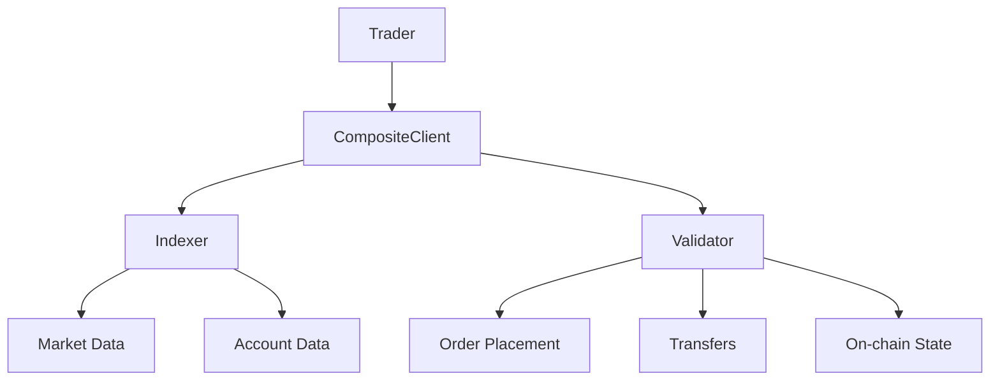

# What is LFG Perp?

**LFG Perp** is a decentralized perpetual futures exchange built on Oraichain, enabling traders to gain leveraged exposure to cryptocurrency markets without expiration dates.

## Overview

Perpetual futures (perps) are derivative contracts that allow you to speculate on the future price of an asset with leverage, but unlike traditional futures, they never expire. LFG Perp brings this powerful trading instrument to the decentralized world with:

- **Non-custodial trading**: You maintain full control of your private keys and funds
- **High leverage**: Access leveraged positions on major cryptocurrencies
- **No expiration**: Positions remain open indefinitely until you close them
- **Funding rates**: Market-driven mechanism to keep perpetual prices anchored to spot prices
- **On-chain settlement**: All trades settled transparently on Oraichain

<Note>
  LFG Perp is built on Oraichain, a Cosmos SDK-based blockchain, ensuring fast
  finality, low costs, and robust security.
</Note>

## How Perpetual Futures Work

### Key Concepts

<AccordionGroup>
  <Accordion title="Perpetual Contracts" icon="infinity">
    Unlike traditional futures with expiration dates, perpetual contracts can be held indefinitely. This makes them ideal for:
    - Long-term position building
    - Flexible trading strategies
    - Avoiding rollover costs
  </Accordion>

{" "}

<Accordion title="Leverage" icon="arrows-maximize">
  Control a large position with a small amount of collateral. For example, with
  10x leverage: - Deposit $1,000 USDC - Control a $10,000 position - Amplified
  gains **and** losses
  <Warning>
    Higher leverage increases liquidation risk. Always monitor your margin
    ratio.
  </Warning>
</Accordion>

{" "}

<Accordion title="Funding Rates" icon="percent">
  Periodic payments between longs and shorts to keep perpetual prices aligned
  with spot prices: - **Positive funding**: Longs pay shorts (bullish market) -
  **Negative funding**: Shorts pay longs (bearish market) - **Calculated every 1
  hour** based on price deviation
</Accordion>

  <Accordion title="Collateral & Margin" icon="shield">
    Your USDC collateral secures your position:
    - **Initial margin**: Required to open a position
    - **Maintenance margin**: Minimum to keep position open
    - **Free collateral**: Available for new positions
    - **Liquidation**: Triggered if margin falls too low
  </Accordion>
</AccordionGroup>

## Why LFG Perp?

### For Traders

<CardGroup cols={2}>
  <Card title="No Intermediaries" icon="ban">
    Trade directly on-chain without trusting centralized exchanges with your
    funds
  </Card>
  <Card title="Transparent" icon="eye">
    All trades, liquidations, and funding rates are visible on-chain
  </Card>
  <Card title="Global Access" icon="globe">
    No KYC, no geographical restrictions, no account freezes
  </Card>
  <Card title="Composable" icon="puzzle-piece">
    Integrate with DeFi protocols, build custom strategies, automate everything
  </Card>
</CardGroup>

### For Developers

<Tabs>
  <Tab title="Programmable">
    Build trading bots, analytics dashboards, custom UIs, and automated
    strategies using our comprehensive SDK.
  </Tab>
  <Tab title="Real-time Data">
    Access live orderbooks, positions, funding rates, and market data through
    REST APIs and WebSockets.
  </Tab>
  <Tab title="Open Source">
    All code is open source. Review, audit, contribute, and build with
    confidence.
  </Tab>
</Tabs>

## Core Components

LFG Perp consists of several key components working together:

### 1. Indexer

- **Purpose**: Fast read-only access to market data
- **Provides**: Orderbooks, prices, account balances, positions, trade history
- **Technology**: REST API + WebSocket for real-time updates

### 2. Validator

- **Purpose**: Blockchain interaction for transactions
- **Provides**: Order placement, transfers, account management
- **Technology**: Cosmos SDK RPC endpoint

### 3. CompositeClient SDK

- **Purpose**: Unified interface for developers
- **Combines**: Indexer (read) + Validator (write) in one convenient client
- **Language**: TypeScript/JavaScript

<Check>
  The CompositeClient abstracts away the complexity of interacting with multiple
  endpoints, making development straightforward.
</Check>

## Markets Available

LFG Perp supports perpetual futures for major cryptocurrencies:

- **BTC-USD**: Bitcoin perpetual
- **ETH-USD**: Ethereum perpetual
- **SOL-USD**: Solana perpetual
- **And more**: Check [lfg.land](https://lfg.land) for the complete market list

Each market features:

- Real-time orderbook
- Oracle-based price feeds
- Funding rate mechanisms
- 24/7 trading

## Security Model

<AccordionGroup>
  <Accordion title="Non-Custodial" icon="key">
    You hold your private keys. LFG Perp never has access to your funds. All operations require your signature.
  </Accordion>

{" "}

<Accordion title="On-Chain Settlement" icon="link">
  Every trade is settled on Oraichain. Full transparency and auditability.
</Accordion>

{" "}

<Accordion title="Oracle Security" icon="satellite-dish">
  Market prices are provided by decentralized oracle networks to prevent
  manipulation.
</Accordion>

  <Accordion title="Liquidation Engine" icon="bolt">
    Automated liquidations protect the solvency of the exchange when positions become undercollateralized.
  </Accordion>
</AccordionGroup>

## Next Steps

<CardGroup cols={2}>
  <Card title="Explore Features" icon="star" href="/introduction/features">
    Dive deeper into LFG Perp's capabilities
  </Card>
  <Card title="Architecture" icon="sitemap" href="/introduction/architecture">
    Learn how LFG Perp is built
  </Card>
  <Card title="Start Development" icon="code" href="/development/overview">
    Begin building on LFG Perp
  </Card>
  <Card title="Trade Now" icon="rocket" href="https://lfg.land">
    Launch the trading app
  </Card>
</CardGroup>
